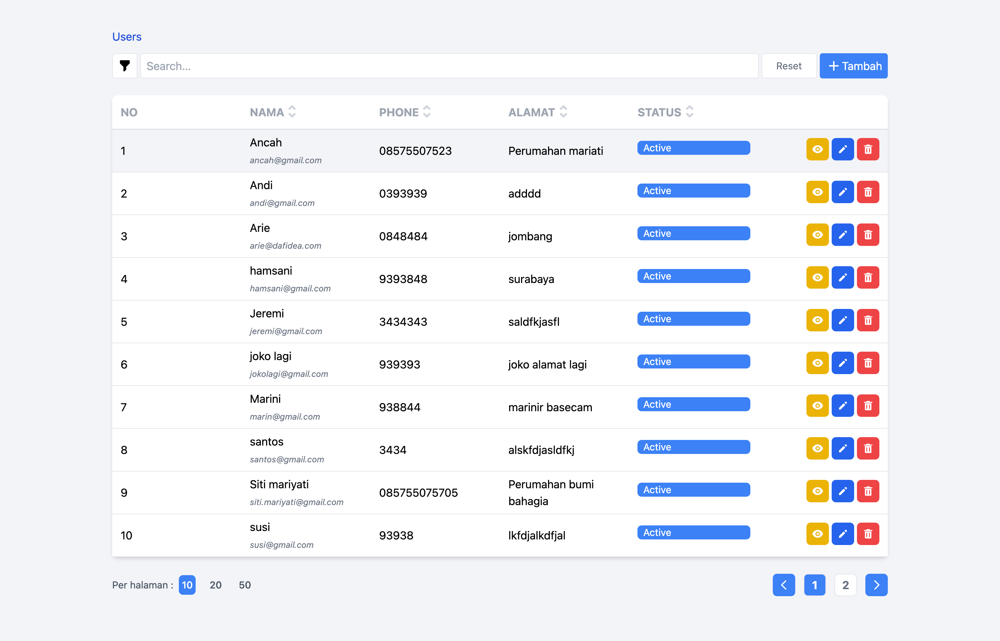
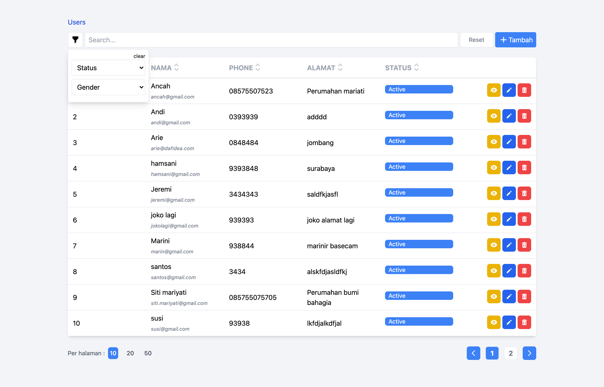
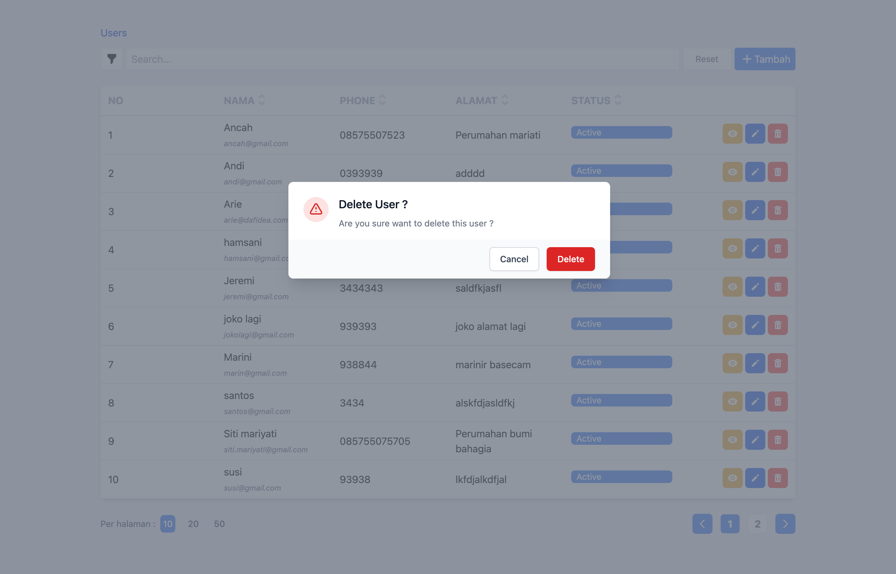
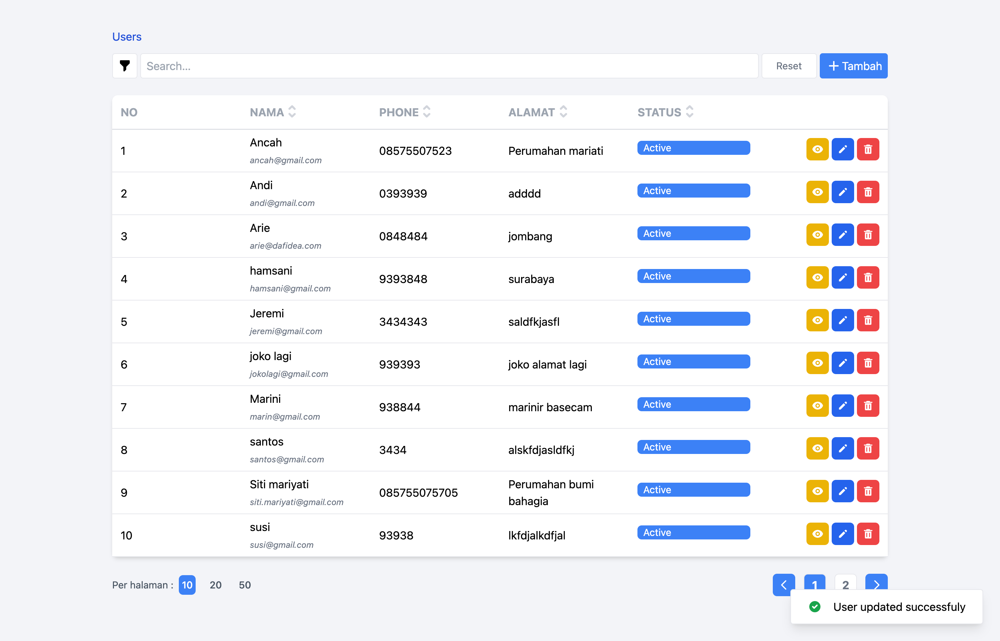
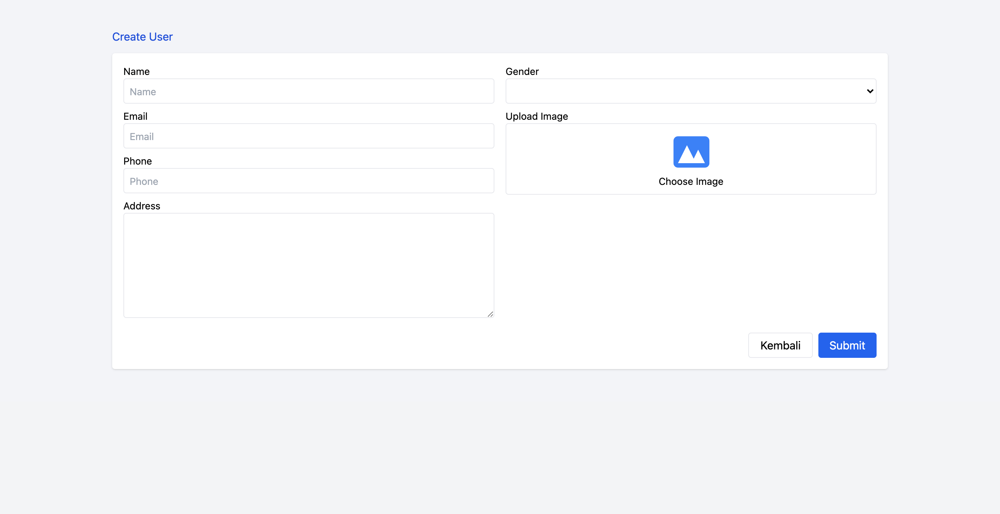
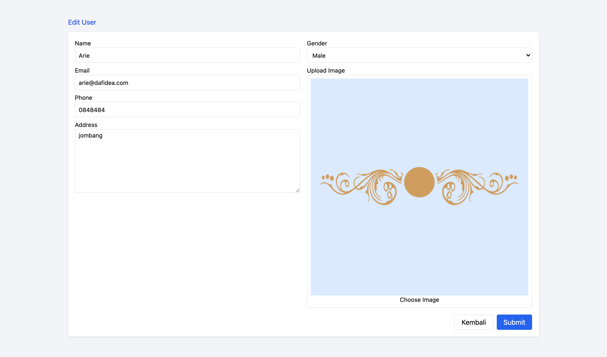
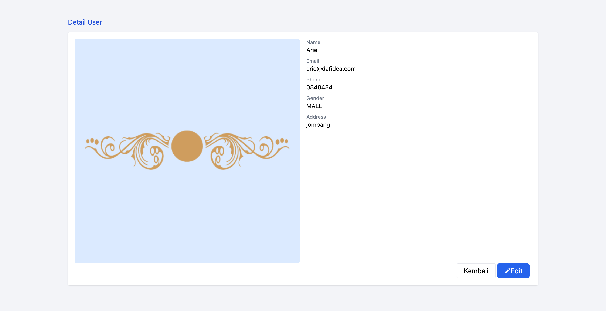

## LARAINTE
Laravel + Inertia + Svelte
-------
Simple Crud Project

## Installation
```
composer install
php artisan key:generate
php artisan storage:link
php artisan migrate --seed
npm install
npm run watch/dev/prod
```


## Screenshots
<table>
    <tr>
        <td colspan="2">
            
            <div>Index Page</div>
        </td>
    </tr>
    <tr>
        <td>
            
            <div>Index Page With Filter</div>
        </td>
        <td>
            
            <div>Delete Confirmation</div>
        </td>
    </tr>
    <tr>
        <td>
            
            <div>Success Message</div>
        </td>
        <td>
            
            <div>Create Page</div>
        </td>
    </tr>
    <tr>
        <td>
            
            <div>Edit Page</div>
        </td>
        <td>
            
            <div>Detail Page</div>
        </td>
    </tr>
</table>


## How to Init Project
## Composer
```
composer create-project laravel/laravel example-app
composer require inertiajs/inertia-laravel
composer require tightenco/ziggy
php artisan inertia:middleware

```

## NPM
```
npm i laravel-mix-svelte
npm i svelte
npm i -D tailwindcss postcss autoprefixer
npx tailwindcss init
npm install @inertiajs/inertia @inertiajs/inertia-svelte
npm install @inertiajs/progress
npm install @babel/plugin-syntax-dynamic-import
npm install svelte-loader --save-dev --legacy-peer-deps
```